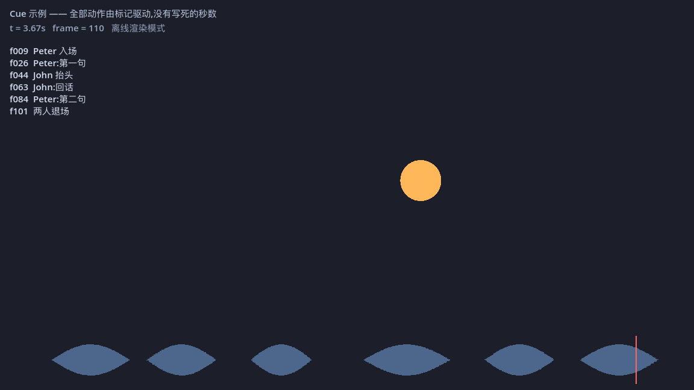

# Cue

**在音频波形上打命名标记,然后在脚本里 `await` 它们。**

Godot 4.7 编辑器插件 + 运行时库,纯 GDScript,无需编译。
为配音驱动的 2D 动画提供:音频波形可视化、命名事件标记、口型时间轴导入,
以及在 Movie Maker 离线渲染下**确定性正确**的时钟。



> *English: Cue is a pure-GDScript Godot 4.7 addon for voice-over–driven 2D animation.
> Mark named cues on an audio waveform in a bottom panel, then `await Cue.at(&"name")`
> in your scripts. Includes a dual-mode clock that keeps Movie Maker renders
> bit-for-bit deterministic. UI and messages are in Chinese.*

---

## 它解决什么问题

Godot 有做程序化 2D 动画视频的全部要素 —— Node2D 场景图、Tween、
AnimationPlayer、Camera2D、Movie Maker 离线渲染 —— 但缺一件事:
**看着波形在配音上打标记,然后在脚本里等这些标记**。

Motion Canvas 有 `waitUntil('event')`,Moho 有内置口型同步。Godot 没有。Cue 补这个洞。

```gdscript
# episode_01/shot_03.gd
Cue.load_sheet(preload("res://audio/shot_03.tres"))
Cue.play()

await Cue.at(&"peter_arrives")
await peter.walk_to(400)

await Cue.at(&"peter_line_1")
peter.say(&"line_1")

await Cue.at(&"john_looks_up")
john.head_turn_to(peter)
```

分镜时间点全都在 `.tres` 里,拖一下标记就改了,**代码一行不用动**。

---

## 安装

1. 把 `addons/cue/` 复制进你项目的 `addons/` 目录
2. 项目 → 项目设置 → 插件 → 启用 **Cue**

插件会自动注册一个名为 `Cue` 的 Autoload。要求 **Godot 4.7 或更高**。

---

## 5 分钟上手

```bash
git clone https://github.com/AmoseCP/godot-cue.git
cd godot-cue
# 用 Godot 4.7 打开这个目录,按 F5
```

示例场景 `examples/hello_cue/main.tscn` 会播放一段合成配音,
两个圆按波形上的六个命名标记行动。打开底部的 **Cue** 面板,
点「打开」选 `examples/hello_cue/shot_01.tres`,就能看到波形和标记。
拖动任意一个标记再按 F5 —— 动作时间点跟着变了。

### 用在自己的项目里

1. 把配音 `.wav` 放进项目(**16-bit PCM**,见下方「音频格式」)
2. 在文件系统里右键 → 新建资源 → `CueSheet`,存成 `.tres`
3. 选中它,在 Inspector 里设置 `audio` 和 `audio_path`,点「在 Cue 面板中打开」
4. 面板里点「分析波形」
5. 播放(空格),在想要的位置按 `M` 加标记,直接打字命名
6. 点「保存」
7. 脚本里 `Cue.load_sheet(...)` → `Cue.play()` → `await Cue.at(&"你的标记名")`

---

## 面板操作

| 操作 | 效果 |
|---|---|
| `空格` | 播放 / 暂停 |
| 左键点波形 | 播放头跳到该处 |
| 左键点/拖标尺 | 拖动播放头 |
| `M` | 在播放头处加标记,并立刻进入命名 |
| 拖动标记顶部三角 | 移动标记 |
| 拖动时按住 `Ctrl` | 临时吸附到帧边界 |
| 双击标记 / `F2` | 改名 |
| `Delete` / `Backspace` | 删除选中标记 |
| 滚轮 | 缩放(鼠标底下的点不跑位) |
| `Ctrl` + 滚轮 | 快速缩放 |
| 中键拖动 | 平移 |
| `Ctrl+Z` / `Ctrl+Y` | 撤销 / 重做 |

**所有编辑操作都走 `EditorUndoRedoManager`**,包括批量导入 ——
导入 200 个口型标记后按一次 `Ctrl+Z` 就全部撤销。

---

## 运行时 API

```gdscript
Cue.load_sheet(sheet: CueSheet) -> void
Cue.play(from: float = 0.0) -> void
Cue.pause() -> void
Cue.resume() -> void
Cue.stop() -> void
Cue.seek(t: float) -> void

await Cue.at(marker: StringName)                  # 等到标记
await Cue.after(marker: StringName, delay: float) # 标记之后再等 delay 秒

Cue.time() -> float                # 当前 sheet 时间(秒)
Cue.frame() -> int                 # 当前帧号
Cue.window(marker) -> Dictionary   # {start, end},到同轨下一个标记
Cue.phonemes(marker) -> Array      # [{t, shape}, ...] 口型序列
Cue.markers_in(track) -> Array[CueMarker]
Cue.is_movie_mode() -> bool

signal Cue.marker_reached(marker_name: StringName)
signal Cue.finished()
```

`at()` 的边界行为(都不会死锁):

- 标记**不存在** → `push_error` 并立即返回
- 标记时间**已过** → 立即返回
- 播放中途 `stop()` → 所有还挂着的 `await` 被唤醒

---

## 确定性:为什么这个插件值得存在

如果动画直接用音频播放位置驱动,用 Movie Maker 渲染出的视频
**每次都会略有不同** —— 音频线程和固定帧步是不同步的。
一整集渲染完才发现帧不一致,是很贵的错误。

`CueClock` 因此是双模的:

- **实时预览** —— 用播放位置,并补偿混音缓冲与输出延迟(画面跟着声音走)
- **离线渲染** —— 时间**完全**由帧计数决定,一个音频状态都不读

验证方式是直接测的,不是推理的:

```bash
tests/determinism.sh
# 帧数:A=91  B=91
# 标记触发帧号一致:start@f2 beat_a@f13 beat_b@f28 beat_c@f45 beat_d@f61 tail@f78
# PASS:91 帧逐帧 SHA256 完全一致
```

同一场景 `--write-movie` 渲染两次,91 帧 PNG 逐帧 SHA256 完全相同,
标记触发帧号也相同。(这 91 个哈希彼此互不相同,所以不是"全空白帧"的假通过。)

**因此,写运行时逻辑时只用 `Cue.time()` / `Cue.frame()` 取时间。**
不要用 `Time.get_ticks_msec()`、不要累加 `delta`、不要直接读
`AudioStreamPlayer.get_playback_position()`。

---

## 音频格式

波形分析只支持**未压缩的 16-bit(或 8-bit)PCM WAV**(`AudioStreamWAV.data`
是 GDScript 唯一能解码的格式;MP3/OGG 解不了)。

**好消息是你基本不用管导入设置。** Godot 4.4+ 默认用 QOA 压缩导入 WAV,
但 Cue 会**优先直接解析源 `.wav` 文件**,完全绕开导入设置。
只有源文件不在项目里时才回退去读导入产物,那时如果是 QOA/ADPCM
会给出明确提示教你关掉压缩。

用 Audacity 导出配音时选「WAV(Microsoft)16-bit PCM」即可。

---

## 口型同步导入

面板工具栏的「导入」支持两种对齐工具的输出:

**[Rhubarb Lip Sync](https://github.com/DanielSWolf/rhubarb-lip-sync)**(英文配音)

```bash
rhubarb -f json -o mouth.json voice.wav
```

每个 `mouthCue` 变成 `mouth` 轨上的一个标记,`payload` 里带
`shape`(Preston Blair 的 A~H / X)和 `end`。

**[Montreal Forced Aligner](https://montreal-forced-aligner.readthedocs.io/)**(含中文配音)

导入 MFA 输出的 `.TextGrid`,`words` 和 `phones` 两条 tier 分别变成两条轨道,
`payload` 里带 `text` 和 `end`。长格式(MFA 默认)和短格式都支持,
空区间(静音)默认跳过。

重复导入不会产生重名 —— 同名标记会自动加 `_1`、`_2` 后缀。

---

## 音画同步微调

macOS 上 `AudioServer.get_output_latency()` 实测返回 `0.0`
(即使用真实的 CoreAudio 驱动),而实际输出延迟通常有 10~20ms。
如果听感上画面慢于声音,调这个项目设置:

**项目设置 → Cue → Playback → Extra Latency Ms**(调大 → 画面提前)

禁用插件时这个设置**不会**被删除,你调好的值不会丢。

---

## 目录结构

```
addons/cue/
├── plugin.cfg / plugin.gd          # EditorPlugin 入口
├── core/                           # 编辑器与运行时共用的数据层
│   ├── cue_sheet.gd                # 音频 + 标记 + 轨道
│   ├── cue_marker.gd               # name / time / track / payload
│   ├── cue_track.gd                # 轨道元数据
│   ├── waveform_cache.gd           # 预计算峰值 + 哈希失效检测
│   ├── pcm_reader.gd               # RIFF 解析 + 格式校验
│   └── waveform_builder.gd         # 分块峰值计算
├── editor/                         # 只在编辑器里跑
│   ├── cue_panel.gd/.tscn          # 底部面板,唯一执行编辑的地方
│   ├── waveform_view.gd            # 绘制与交互
│   ├── ruler.gd  transport.gd
│   ├── cue_view_state.gd           # 共享视图状态
│   └── inspector_plugin.gd
├── runtime/                        # 不依赖编辑器,可导出、可 headless
│   ├── cue.gd                      # Autoload 单例
│   └── cue_clock.gd                # 双模时间源
└── import/
    ├── rhubarb_importer.gd
    ├── textgrid_importer.gd
    └── import_result.gd
```

`runtime/` 和 `core/` **不引用** `editor/` 下的任何东西,
所以导出的项目和 headless CLI 渲染里都能跑。

---

## 性能

在 M1 MacBook / Godot 4.7.2 上实测:

| 项目 | 门槛 | 实测 |
|---|---|---|
| 5 分钟 44.1kHz 单声道 WAV 首次分析 | ≤ 2000ms | **1146ms** |
| 波形缓存命中 | ≤ 100ms | **0ms** |
| 缩放 60s/屏 → 0.2s/屏,最慢一帧 | ≤ 20ms(50fps) | **2ms** |

峰值是**精确的** min/max,没有做步进近似。
分块 `await` 只是为了不冻结编辑器 UI。

---

## 测试

```bash
tests/run_all.sh                 # 全部机器可验的测试
tests/determinism.sh             # 只跑双次渲染哈希比对
```

| 套件 | 覆盖 | 断言数 |
|---|---|---|
| `tests/test_core.gd` | PCM 解码、峰值、缓存、排序、吸附、绘制性能 | 69 |
| `tests/test_runtime.gd` | `Cue` / `CueClock`、`at()` 边界 | 25 |
| `tests/test_import.gd` | Rhubarb / TextGrid 解析 | 50 |
| `tests/edit_harness/` | undo/redo、持久化、批量导入(需编辑器) | 80 |
| `tests/toggle_harness/` | 插件反复启停无泄漏(需编辑器) | 10 轮 |
| `tests/determinism.sh` | 双次渲染逐帧 SHA256 | 91 帧 |

UI 交互无法自动化,清单见 [`tests/MANUAL.md`](tests/MANUAL.md)。

---

## 明确不做

音频剪辑、降噪、电平调整、混音、音频效果,以及**任何写回音频文件的操作**。

Cue 只读音频。剪辑归 Audacity。范围失控是这类工具最常见的死法。

---

## 许可

MIT。见 [LICENSE](LICENSE)。
